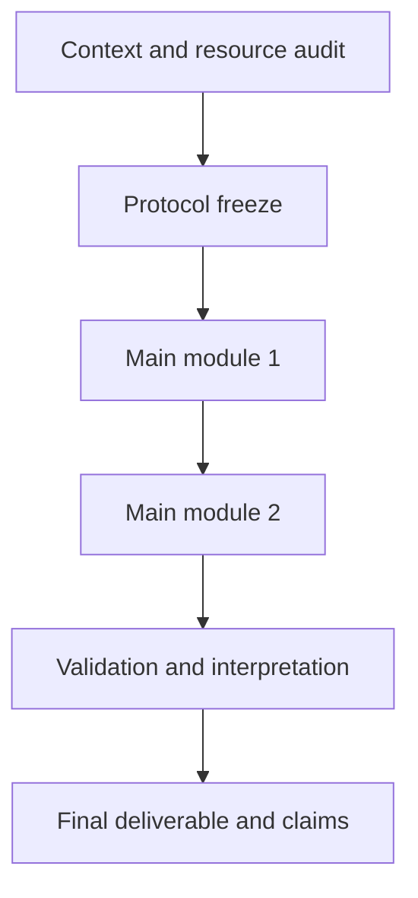

# Document Structure Template

Use this as a flexible skeleton. Keep the reference document's rhythm, but adapt section names and modules to the topic.

```markdown
# <Topic> Study Design

日期：YYYY-MM-DD  
文档状态：研究设计草案 / protocol draft / proposal draft  
适用课题：<topic, domain, object, scenario>  
核心目标：<one sentence stating the main claim, objective, or deliverable>

---

## 1. 研究定位

Start by explaining why the topic should not be reduced to a weak or narrow framing. Then state the stronger framing and explain why it is more meaningful.

Include:

- the weak framing to avoid;
- why that framing would be insufficient;
- the stronger research, system, theoretical, or proposal framing;
- the value of the topic;
- what evidence would make the design convincing;
- what the project should not overclaim.

## 2. 核心研究问题与假设/目标

### 2.1 主研究问题或主目标

State the primary question or goal and explain why it is central. Clarify what evidence would answer it and what evidence would not be sufficient.

### 2.2 次级问题、辅助目标或可检验假设

Separate confirmatory, supporting, and exploratory questions. If hypotheses are inappropriate, use design claims, engineering objectives, theoretical propositions, or review questions.

For each item, state:

- reason;
- evidence route;
- minimum support standard;
- failure or downgrade interpretation.

## 3. 总体研究架构

Describe the study as a staged architecture, evidence chain, workflow, system flow, or reasoning path.

Use a Mermaid diagram when useful:



Add a stage table:

| Stage/Module | Purpose | Inputs | Main task | Output | Decision gate |
|---|---|---|---|---|---|

After the table, explain why the stages occur in this order, which outputs become fixed inputs, and what result would force redesign.

## 4-N. Topic-Specific Modules

Each major module should contain the following elements, but write them in connected prose rather than terse labels.

### Purpose

Explain why the module is necessary and which research question, objective, or claim it supports.

### Design Principles

Explain what must be fixed, controlled, compared, derived, protected, measured, or validated. If no baseline, control, or comparison is appropriate, say so and explain why.

### Concrete Workflow

Describe execution steps in an actionable order. Include preparation, execution, quality checks, logging, and handoff to later stages when relevant.

### Inputs and Outputs

Use a table when helpful, then explain how the outputs become evidence or inputs for later stages.

### Expected Results

Describe ideal, minimum acceptable, ambiguous, and negative-result patterns. Explain how each pattern changes the interpretation.

### Success Criteria

State decision rules, thresholds, acceptance criteria, or observable evidence.

### Failure or Risk Signals

State what would invalidate, weaken, delay, or redirect the module, and how the design should respond.

### Notes

State assumptions, boundaries, and what is intentionally not covered.

## N+1. Validation and Quality Control

Cover checks appropriate to the topic: data/source integrity, leakage or contamination, measurement reliability, implementation tests, statistical credibility, reproducibility, ethics, permissions, robustness, stakeholder acceptance, deployment, or maintenance.

For each check, state why it matters, how to perform it, what artifact records it, and what happens if it fails.

## N+2. Risk Control and Result Interpretation

Use a risk matrix and interpretation prose:

| Risk | Why it matters | Signal | Mitigation | Interpretation if unresolved |
|---|---|---|---|---|

Include an interpretation matrix for positive, partial, negative, and ambiguous results.

## N+3. Execution Order

Write phases as work packages. For each phase include tasks, prerequisites, expected outputs, decision gate, and blocking risks. Explain how each phase prepares the next phase.

## N+4. Minimum Deliverable and Enhanced Versions

Define:

- minimum deliverable version;
- strong version;
- enhanced/top-tier version.

For each version, state required modules, evidence, outputs, and claim level.

## N+5. Possible Titles

Provide 3-5 titles that emphasize the research value or contribution rather than only the method.

## N+6. Final Logic Chain

Write a numbered causal or evidentiary chain from motivation to final claim. It should be detailed enough to act as the backbone of a manuscript, proposal, or protocol.
```
